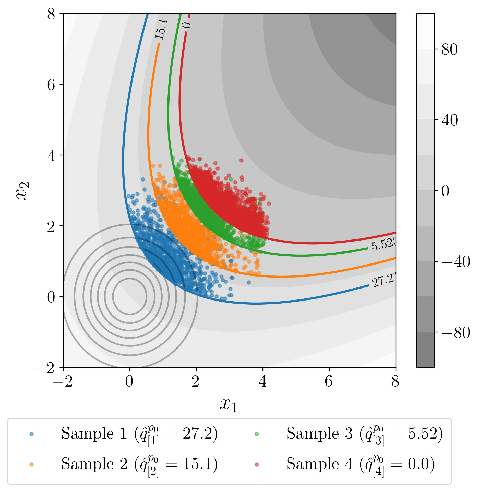

# Bernstein Adaptive Nonparametric Conditional Sampling (BANCS)

BANCS is a rare event estimation algorithm using the same structure as other adaptive importance sampling methods (e.g., nonparametric adaptive importance sampling [1] or AIS-CE [2]) while employing a different approach to fit the intermediate conditional distributions. 

At step $k$, after estimating the intermediary $p_0$-order quantile $\widehat{q}_{[k]}^{p_0}$, a nonparametric model is fitted on the set $\mathbf{A}_{[k+1]}$ of all samples leading to values below $\widehat{q}_{[k]}^{p_0}$ (see step 1 and 2 in Fig. XX and XX). This inference is decomposed into a fit of the marginals (by univariate KDE) and a fit of the copula (by empirical Bernstein copula [3]).

The generation of the next i.i.d. sample on the conditional distributions is straightforward and does not require MCMC sampling like in subset simulation [4]. Note that BANCS does not require iso-probabilistic transform and can directly operate in the "physical space".


## Example on parabolic function
```
>>> #!/usr/bin/env python3
>>> import numpy as np
>>> import openturns as ot
>>> from bancs import BANCS

>>> # Reliability problem
>>> g = ot.SymbolicFunction(["x1", "x2"], ["(x1 - x2) ^ 2 - 8 * (x1 + x2 - 5)"])
>>> X = ot.ComposedDistribution([ot.Normal(0., 1.)] * 2)
>>> Y = ot.CompositeRandomVector(g, ot.RandomVector(X))
>>> threshold = 0.
>>> failure_event = ot.ThresholdEvent(Y, ot.LessOrEqual(), threshold)
>>> pf_ref = 0.0001315399999999369 # Reference computed with very large

>>> # BANCS 
>>> bancs = BANCS(failure_event, N=int(1e4), M=20, p0=0.1)
>>> quantiles = bancs.run()
>>> pf_bancs = bancs.compute_pf()
>>> pf_variance = bancs.compute_var()
>>> print(f"Relative error = {np.abs(pf_bancs - pf_ref) / pf_ref:.2%}")
Relative error = 1.09%
```



**Figure 1:** BANCS iterations on the two-dimensional reliability problems (for $N=10^4$ and $p_0=0.1$). Only the samples exceeding the intermediary thresholds are represented.


## References

[1] Morio, J. (2011). Non-parametric adaptive importance sampling for the probability estimation of a launcher impact position. *Reliability Engineering and System Safety*, 96(1):178–183.

[2] Rubinstein, R. Y. and Kroese, D. P. (2004). *The cross-entropy method: a unified approach to combinatorial optimization, Monte-Carlo simulation, and machine learning*, volume 133. Springer.

[3] Sancetta, A. and Satchell, S. (2004). The Bernstein copula and its applications to modeling and approximations of multivariate distributions. *Econometric Theory*, 20(3):535–562

[4] Au, S.-K. and Beck, J. L. (2001). Estimation of small failure probabilities in high dimensions by
subset simulation. *Probabilistic Engineering Mechanics*, 16(4):263–277.